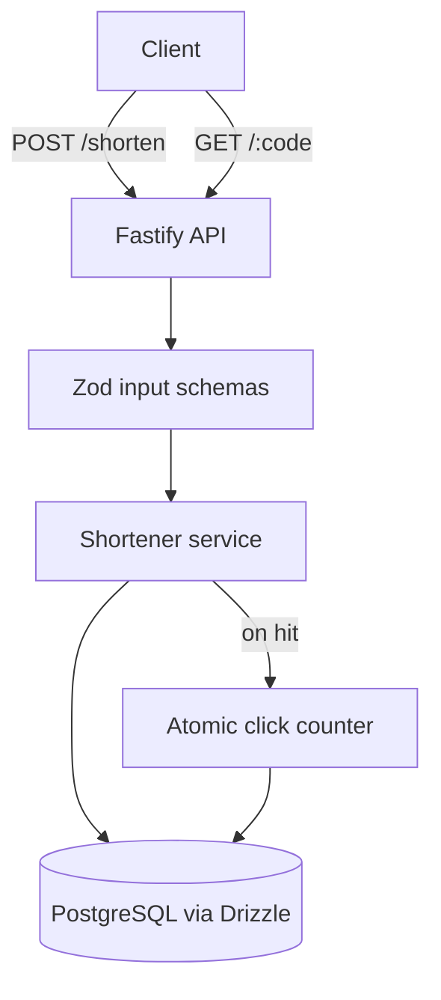

# Implementation Plan: URL Shortener API

**Generated:** 2026-04-25
**Status:** APPROVED (example artifact — not a real project)
**Approved by:** RAD (illustrative)

## 1. Project Summary

**Goal:** Ship a small JSON API that turns long URLs into short codes, redirects on lookup, and tracks click counts. Single-tenant, no auth, ~3 endpoints.

**Scope:**
- In: `POST /shorten`, `GET /:code`, `GET /:code/stats`, persistence in PostgreSQL, Docker deploy.
- Out: User accounts, custom slugs, rate limiting, analytics dashboard.

**Success Criteria:**
- [ ] All three endpoints respond correctly with documented contracts.
- [ ] `POST /shorten` returns the same code for an identical URL within 24h (idempotency).
- [ ] Click counts increment exactly once per redirect under concurrent load (10 req/sec).

**Tech Stack:**
- Backend: Fastify 5.x (Node.js 22 LTS)
- Database: PostgreSQL 16
- ORM: Drizzle 0.36+
- Validation: Zod 4
- Test: Vitest 2 + supertest

**Constraints:**
- TypeScript strict mode, no `any`.
- All routes Zod-validated at boundary.
- All DB writes through Drizzle (no raw SQL except migrations).

## 2. Architecture

**Key Design Decisions:**
| Decision | Choice | Rationale |
|---|---|---|
| Code generation | nanoid(8) | URL-safe, low collision at expected scale, no DB lookup for uniqueness check on first attempt |
| Click counter | `UPDATE ... RETURNING` | Avoids read-modify-write race under concurrent redirects |
| Persistence | PostgreSQL `urls` table with unique index on URL hash | Idempotent shortening without exposing the hash |

## 3. Target Files

Files to be **created**:
- `src/server.ts` — Fastify bootstrap
- `src/routes/shorten.ts` — POST handler
- `src/routes/redirect.ts` — GET handlers
- `src/db/schema.ts` — Drizzle schema
- `src/db/client.ts` — Drizzle client setup
- `src/services/shortener.ts` — Code generation + lookup
- `migrations/0001_initial.sql` — Initial schema
- `__tests__/routes/shorten.test.ts`
- `__tests__/routes/redirect.test.ts`
- `__tests__/services/shortener.test.ts`

Files to be **modified**:
- `package.json` — Add deps and scripts
- `tsconfig.json` — strict mode

Files to **NOT touch**: N/A (greenfield).

## 4. Milestones

| # | Milestone | Goal | Key Artifacts | Est. Complexity |
|---|---|---|---|---|
| M1 | Scaffold | Fastify boot + DB connection + first migration | server.ts, schema.ts, migration | 3/10 |
| M2 | Core service | Shorten + lookup logic with tests | shortener.ts, route handlers | 5/10 |
| M3 | Concurrency hardening | Idempotency + click-count race fix | Updated service + tests | 6/10 |
| M4 | Deploy | Dockerfile + smoke tests | Dockerfile, CI | 3/10 |

## 5. Implementation Steps

### Phase 1: Scaffold (Milestone M1)

- [ ] **[PENDING]** S1: Initialize project + TypeScript strict
  - **Objective:** package.json, tsconfig.json with strict mode, scripts for dev/build/test
  - **Main changes:** package.json, tsconfig.json, .gitignore
  - **Dependencies:** None
  - **Priority:** High
  - **Complexity:** 2
  - **Definition of Done:** `npm run build` exits 0; `tsc --noEmit` passes
  - **Validation:** `npm run build && npx tsc --noEmit`
  - **Rollback:** `git clean -fd && git checkout -- .`
  - **Test Strategy:** No tests yet; validate config by running build

- [ ] **[PENDING]** S2: Boot Fastify with health endpoint
  - **Objective:** Minimal server.ts listening on PORT, GET /healthz returning {status:"ok"}
  - **Main changes:** src/server.ts, package.json deps (fastify, @fastify/sensible)
  - **Dependencies:** [S1]
  - **Priority:** High
  - **Complexity:** 2
  - **Definition of Done:** `curl localhost:3000/healthz` returns `{"status":"ok"}`
  - **Validation:** `node --test __tests__/health.test.ts` — uses fastify.inject() to hit /healthz
  - **Rollback:** `git checkout -- src/server.ts package.json`
  - **Test Strategy:** Inject test, asserts 200 + body shape

- [ ] **[PENDING]** S3: PostgreSQL connection + Drizzle schema
  - **Objective:** urls table with id, code, original_url, url_hash (unique), click_count, created_at
  - **Main changes:** src/db/schema.ts, src/db/client.ts, migrations/0001_initial.sql, drizzle.config.ts
  - **Dependencies:** [S1]
  - **Priority:** High
  - **Complexity:** 4
  - **Definition of Done:** Migration applies cleanly to a fresh DB; Drizzle client resolves
  - **Validation:** `npx drizzle-kit migrate && npm run db:smoke` (smoke = SELECT 1)
  - **Rollback:** `npx drizzle-kit drop && git checkout -- migrations/ src/db/`
  - **Test Strategy:** Integration test that inserts + selects a row; mocks NOT used for DB

### Phase 2: Core Service (Milestone M2)

- [ ] **[PENDING]** S4: Shortener service — code generation + persistence
  - **Objective:** generateCode(url) returns existing code if URL hash matches, else creates new with nanoid(8)
  - **Main changes:** src/services/shortener.ts
  - **Dependencies:** [S3]
  - **Priority:** High
  - **Complexity:** 5
  - **Definition of Done:** Pure-function tests for code gen pass; DB integration test confirms idempotency
  - **Validation:** `npx vitest run __tests__/services/shortener.test.ts`
  - **Rollback:** `git checkout -- src/services/shortener.ts __tests__/services/`
  - **Test Strategy:** Unit (mocked DB) for code gen logic; integration (real DB) for idempotency. Edge cases: empty URL (reject), URL > 2048 chars (reject), unicode URL.

- [ ] **[PENDING]** S5: POST /shorten route
  - **Objective:** Zod-validate body {url: string}, call service, return {code, short_url}
  - **Main changes:** src/routes/shorten.ts, src/server.ts (route registration)
  - **Dependencies:** [S4]
  - **Priority:** High
  - **Complexity:** 3
  - **Definition of Done:** Returns 201 with code on valid URL; 400 on invalid; 200 on duplicate URL within 24h
  - **Validation:** `npx vitest run __tests__/routes/shorten.test.ts`
  - **Rollback:** `git checkout -- src/routes/shorten.ts src/server.ts`
  - **Test Strategy:** fastify.inject() — happy path, malformed body, duplicate URL idempotency, oversized URL

- [ ] **[PENDING]** S6: GET /:code redirect + GET /:code/stats
  - **Objective:** Lookup by code, 302 to original_url + increment counter; stats returns {clicks, created_at}
  - **Main changes:** src/routes/redirect.ts, src/server.ts
  - **Dependencies:** [S4]
  - **Priority:** High
  - **Complexity:** 4
  - **Definition of Done:** Unknown code → 404; valid → 302 with Location header; stats → 200 with click count
  - **Validation:** `npx vitest run __tests__/routes/redirect.test.ts`
  - **Rollback:** `git checkout -- src/routes/redirect.ts src/server.ts`
  - **Test Strategy:** fastify.inject() for both endpoints. Edge cases: nonexistent code, code with special chars, stats for code with 0 clicks.

### Phase 3: Concurrency Hardening (Milestone M3)

- [ ] **[PENDING]** S7: Atomic click counter (race fix)
  - **Objective:** Replace SELECT/UPDATE with `UPDATE urls SET click_count = click_count + 1 WHERE code = $1 RETURNING original_url`
  - **Main changes:** src/services/shortener.ts (lookup function), src/routes/redirect.ts (use single-call form)
  - **Dependencies:** [S6]
  - **Priority:** High
  - **Complexity:** 5
  - **Definition of Done:** Concurrent test with 100 redirects yields exactly count=100 (no lost updates)
  - **Validation:** `npx vitest run __tests__/concurrency/click-counter.test.ts`
  - **Rollback:** `git checkout -- src/services/shortener.ts src/routes/redirect.ts`
  - **Test Strategy:** Promise.all of 100 redirects against the same code, assert final count exactly 100. Mocks NOT used (this only fails on real DB).

- [ ] **[PENDING]** S8: URL hash idempotency under concurrent shorten
  - **Objective:** Use INSERT ... ON CONFLICT (url_hash) DO NOTHING RETURNING code so two concurrent shorten requests for the same URL return the same code
  - **Main changes:** src/services/shortener.ts (createCode function)
  - **Dependencies:** [S4, S7]
  - **Priority:** High
  - **Complexity:** 4
  - **Definition of Done:** Concurrent shorten test with 50 calls for the same URL yields exactly 1 row + 50 identical responses
  - **Validation:** `npx vitest run __tests__/concurrency/shorten-idempotency.test.ts`
  - **Rollback:** `git checkout -- src/services/shortener.ts`
  - **Test Strategy:** Promise.all of 50 POST /shorten with same URL, assert all responses share one code, DB has 1 row.

### Phase 4: Deploy (Milestone M4)

- [ ] **[PENDING]** S9: Dockerfile + docker-compose for local dev
  - **Objective:** Multi-stage build (deps → build → runtime), compose with Postgres
  - **Main changes:** Dockerfile, docker-compose.yml, .dockerignore
  - **Dependencies:** [S2, S3]
  - **Priority:** Medium
  - **Complexity:** 3
  - **Definition of Done:** `docker compose up` brings API + DB up; healthz returns 200
  - **Validation:** `docker compose up -d && sleep 5 && curl -f localhost:3000/healthz && docker compose down`
  - **Rollback:** `git checkout -- Dockerfile docker-compose.yml .dockerignore && docker compose down -v`
  - **Test Strategy:** Smoke — healthz only. Full route tests run via vitest, not container.

- [ ] **[PENDING]** S10: CI smoke test (GitHub Actions)
  - **Objective:** PR pipeline runs build + lint + test + docker compose smoke
  - **Main changes:** .github/workflows/ci.yml
  - **Dependencies:** [S5, S6, S7, S8, S9]
  - **Priority:** Medium
  - **Complexity:** 3
  - **Definition of Done:** PR CI green on a clean commit; fails on intentional regression
  - **Validation:** Push a no-op commit; CI completes <5min, all jobs green
  - **Rollback:** `git rm .github/workflows/ci.yml`
  - **Test Strategy:** Mutation test — comment out the click-counter UPDATE statement, push to a feature branch, confirm CI catches it

## 6. Checkpoints

### Checkpoint 1: After Phase 1 (M1)
- **Gate:** S1, S2, S3 must be [VERIFIED]
- **Validation:** `npm run build && npx vitest run` (no tests yet for S1, but build + healthz test must pass)
- **Rollback:** `git reset --hard <pre-M1 commit>`
- **Human Review:** Verify the migration matches expectations before continuing

### Checkpoint 2: After Phase 2 (M2)
- **Gate:** S4, S5, S6 [VERIFIED]
- **Validation:** Full vitest suite passes; manual `curl POST /shorten` + `curl GET /:code` round-trip
- **Rollback:** Revert S4–S6 commits; DB rollback via `npx drizzle-kit drop && drizzle-kit migrate`
- **Human Review:** Confirm response shapes match documented contracts before deploy work starts
- **Context Action:** Commit, then `/rad-planner:checkpoint` to dump state. Recommend `/clear` before starting M3 — concurrency reasoning needs a clean window.

### Checkpoint 3: After Phase 3 (M3)
- **Gate:** S7, S8 [VERIFIED]
- **Validation:** Concurrency tests green
- **Rollback:** Revert to end-of-M2; M3 changes are isolated to one file
- **Human Review:** Spot-check the SQL — atomic UPDATE and ON CONFLICT clauses are easy to subtly break

## 7. Risks and Considerations

### Technical Risks
| Risk | Likelihood | Impact | Mitigation |
|---|---|---|---|
| nanoid collision at higher scale than expected | Low | Medium | Catch unique-violation on insert, retry once with new code; add scale alerting |
| URL hash function (SHA-256 vs. xxhash) chosen wrong for idempotency window | Low | High | Test idempotency with whitespace-equivalent URLs; document the canonicalization rule |
| Drizzle 0.36 breaking change between plan and execution | Medium | Low | Pin to ~0.36.x; revisit if the project lives long enough to upgrade |

### Edge Cases to Handle
- Empty body POST → 400 with explicit message (not 500)
- URL longer than 2048 chars → 413
- URL with spaces / fragments / unicode → preserve as-is (no eager canonicalization)
- Lookup of a code that was never created → 404 (not 500)

### Anti-Pattern Warnings
- This plan avoids #9 (Fallback Trap) — concurrency fixes use atomic SQL, not silent retry loops.
- This plan avoids #11 (Stale APIs) — Drizzle 0.36 syntax verified against current docs (2026-04).
- S10 CI mutation test enforces #14 (Shoot and Forget) at the org boundary.

### Context Management Notes
- Plan estimated to fit in a single Claude Code session at execution time, with one mandatory clear after M2 (concurrency work benefits from a fresh context window).
- Reference files needed in execution session: this plan + the project README. CLAUDE.md is generated by `/rad-planner:generate-project-config` once approved.
