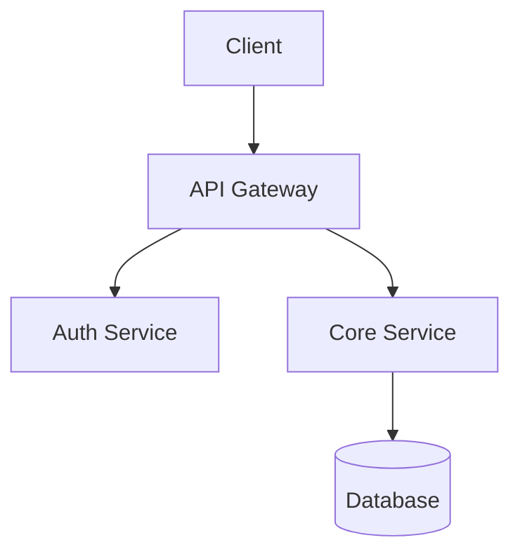

# Plan Output Templates — 5-File Split (3.0+)

rad-planner 3.0 emits the **RAD 8-doc standard** at project root (or `--output-dir`). This file documents the template structure for the five strategic/operational files produced by `/plan` Phase 6, plus the shared rules that apply across all of them.

For the canonical 8-doc specification (ownership, length targets, update triggers, pruning rules), see `docs/doc-conventions.md` (pointer to `docs/doc-conventions.md`).

For `tasks.md` (machine-readable, validated by `plan-lint.py`), see `references/task-format.md`.

---

## 1. PRD.md

**Owner:** `/rad-planner:plan` Phase 6 (initial) + manual edits + `/plan --reboot` (regenerate).
**Target length:** 50–150 lines. Revise sections in place; do not append a changelog tail.

```markdown
# PRD: [Project Name]

**Generated:** [Date]
**Status:** [DRAFT | UNDER REVIEW | APPROVED]
**Approved by:** [Name or "Pending"]

## Goal

[1-2 sentences describing the core objective. The "why" of the project.]

## Scope

**In scope:**
- [Capability 1]
- [Capability 2]

**Out of scope:**
- [Explicit non-goal 1]
- [Explicit non-goal 2]

## Success Criteria

- [ ] [Measurable criterion 1]
- [ ] [Measurable criterion 2]
- [ ] [Measurable criterion 3]

## Tech Stack Summary

- Language: [name + version]
- Frontend: [framework + version]
- Backend: [framework + version]
- Database: [system + version]
- Key Libraries: [list]

(Full rationale lives in ARCHITECTURE.md and DECISIONS.md.)

## Constraints

- [Security requirement]
- [Performance expectation]
- [Dependency version pin]
- [Coding convention]
- [Compliance / regulatory note]

## Target Users / Use Cases

- [Persona 1]: [primary workflow]
- [Persona 2]: [primary workflow]
```

---

## 2. ARCHITECTURE.md

**Owner:** `/rad-planner:plan` Phase 6 (initial) + manual edits + `/plan --reboot` (regenerate).
**Target length:** 100–300 lines. Component diagrams count toward the budget.

```markdown
# Architecture: [Project Name]

**Last updated:** [Date]

## Component Diagram



## System Boundaries

- **External interfaces:** [public APIs, webhooks, file uploads, etc.]
- **Internal interfaces:** [service-to-service contracts, message queues, etc.]
- **Trust boundary:** [where untrusted input crosses into the system]

## Data Flow

[Describe how data moves through the components — in what order, with what
transformations, persisted where, queried by whom. Sequence diagram optional.]

## Key Design Decisions

| # | Decision | Choice | Rationale |
|---|---|---|---|
| 1 | [Decision] | [Choice] | [Why] |
| 2 | [Decision] | [Choice] | [Why] |

(Full chronological decision history with supersession lives in DECISIONS.md.)

## Target Files

Files to be **created**:
- `src/lib/auth.ts` — Authentication utilities
- `src/api/routes/users.ts` — User API endpoints

Files to be **modified**:
- `src/app/layout.tsx` — Add auth provider wrapper
- `package.json` — Add dependencies

Files to **NOT touch**:
- `src/config/legacy.ts` — Deprecated, scheduled for removal
```

---

## 3. ASSUMPTIONS.md

**Owner:** `/rad-planner:plan` Phase 1 capture + `/rad-session:wrapup` Phase 3.5 prompt + manual edits.
**Target length:** 20–80 lines. Aim for tight one-line entries.

```markdown
# Assumptions: [Project Name]

Non-obvious truths about the project's reality that wouldn't be evident from reading the code. Captured during planning, augmented during sessions when new assumptions surface.

When an assumption invalidates, mark it `~~Invalidated YYYY-MM-DD — <reason>~~` rather than deleting. Audit trail matters.

## Current

- [YYYY-MM-DD] No real users yet — we can break backward compatibility freely until M3.
- [YYYY-MM-DD] Single-tenant only; multi-tenant would require schema rework.
- [YYYY-MM-DD] Sensitive data — no real credentials, PII, or production data ever land in the repo. `.env.example` is the contract.
- [YYYY-MM-DD] Team has no Rust experience; stick to TypeScript + Python until that changes.
- [YYYY-MM-DD] The DB can be rebuilt from migrations anytime in the next 30 days — backfill not required.

## Invalidated

- ~~[2026-03-12] Stripe test mode is sufficient through M2 — Invalidated 2026-04-25: M2 scope now includes real-money flows, switching to test mode in dev / live in staging.~~
```

---

## 4. DECISIONS.md

**Owner:** `/rad-planner:plan` Phase 6 (initial entries from stack rationale + risk-assessor verdicts) + `/rad-session:wrapup` Phase 3.5 prompt + manual edits.
**Target length:** 50–500 lines while in index-style. Above ~500 lines, prompt to convert to ADR layout at `decisions/NNNN-slug.md`.

**Append-only**, with sequence numbers (`0001`, `0002`, …). Superseded entries stay in place with their status updated.

```markdown
# Decisions: [Project Name]

Chronological architecture and tooling decisions. Append new entries; never delete.

## 0001 — 2026-04-25 — Chose Fastify over Express

**Status:** Active

**Context:** Need an HTTP server with first-class TypeScript types and good async handling. Existing team has Express experience but no strong attachment.

**Decision:** Fastify 5.x. Native TS types, faster routing, schema-based validation hook fits our Zod-everywhere pattern.

**Consequences:** Team learns Fastify lifecycle (1-2 days). We accept smaller plugin ecosystem vs. Express. Migration cost ~minimal at current size.

---

## 0002 — 2026-04-25 — PostgreSQL over MongoDB for primary store

**Status:** Active

**Context:** URL shortener data is relational (urls table, clicks counter). Idempotency requires unique constraints on URL hash.

**Decision:** PostgreSQL 16 with Drizzle 0.36 ORM. Atomic UPDATE...RETURNING for click counter; ON CONFLICT for idempotent shortening.

**Consequences:** Single-node Postgres sufficient for projected scale. Operational story: managed Postgres on Supabase/Neon when we deploy.

---

## 0003 — 2026-05-01 — Switched ingress from Traefik to Caddy

**Status:** Superseded by 0007 (reboot 2026-05-13)

**Context:** [original context preserved]
**Decision:** [original decision preserved]
**Consequences:** [original consequences preserved]
```

**Supersession syntax.** When a later decision overrides an earlier one (typical during `/plan --reboot`), update the prior entry's **Status** line:

```markdown
**Status:** Superseded by <new-entry-number> (reboot YYYY-MM-DD)
```

The body of the superseded entry stays as-is — the audit trail of "what we thought at the time" is the point.

**~500-line ADR-layout threshold.** When DECISIONS.md crosses ~500 lines, `/plan --reboot` surfaces a separate prompt asking whether to convert to `decisions/NNNN-slug.md` ADR-per-file layout. This is a decoupled decision — it's not automatic in 4.0. After conversion, supersession references remain numeric (`Superseded by 0042`) but `0042` resolves to a filename rather than an in-file entry.

---

## 5. PLAN.md

**Owner:** `/rad-planner:plan` Phase 6 + `/rad-planner:status` (task-state updates) + executor + manual edits at milestone boundaries.
**Target length:** 100–400 lines. If a single project's PLAN exceeds 400 lines, split by milestone into `plans/M1.md`, `plans/M2.md`, with PLAN.md becoming an index.

```markdown
# Plan: [Project Name]

**Generated:** [Date]
**Status:** [DRAFT | UNDER REVIEW | APPROVED | IN PROGRESS | COMPLETED]
**Approved by:** [Name or "Pending"]

## Milestones

| # | Milestone | Goal | Key Artifacts | Est. Complexity |
|---|---|---|---|---|
| M1 | Scaffold | Project boot + DB connection + first migration | server.ts, schema.ts | 3/10 |
| M2 | Core service | Shorten + lookup logic with tests | shortener.ts, route handlers | 5/10 |
| M3 | Hardening | Idempotency + race fix | Updated service + tests | 6/10 |
| M4 | Deploy | Dockerfile + smoke CI | Dockerfile, ci.yml | 3/10 |

## Implementation Steps

### Phase 1: Scaffold (Milestone M1)

- [ ] **[PENDING]** S1: Initialize project + TypeScript strict
  - **Objective:** package.json, tsconfig.json with strict mode, scripts for dev/build/test
  - **Main changes:** package.json, tsconfig.json, .gitignore
  - **Dependencies:** None
  - **Priority:** High
  - **Complexity:** 2/10
  - **Definition of Done:** `npm run build` exits 0; `tsc --noEmit` passes
  - **Validation:** `npm run build && npx tsc --noEmit`
  - **Rollback:** `git clean -fd && git checkout -- .`
  - **Test Strategy:** No tests yet; validate config by running build

- [ ] **[PENDING]** S2: Boot HTTP framework with health endpoint
  - [continue pattern…]

### Phase 2: Core Service (Milestone M2)

[Continue pattern...]

## Checkpoints

### Checkpoint 1: After Phase 1 (M1)
- **Gate:** S1, S2, S3 must be [VERIFIED]
- **Validation:** `npm run build && npx vitest run`
- **Rollback:** `git reset --hard <pre-M1 commit>`
- **Human Review:** Verify the migration matches expectations before continuing

### Checkpoint 2: After Phase 2 (M2)
[Continue pattern...]

## Risks and Considerations

### Technical Risks

| Risk | Likelihood | Impact | Mitigation |
|---|---|---|---|
| [Risk 1] | Medium | High | [Specific mitigation] |
| [Risk 2] | Low | High | [Specific mitigation] |

### Edge Cases to Handle

- [Edge case 1]: [How to handle]
- [Edge case 2]: [How to handle]

### Anti-Pattern Warnings

- This plan avoids [anti-pattern X] by [specific approach]
- Task S5 explicitly does NOT [anti-pattern Y] because [reason]

### Context Management Notes

- Clear session after Checkpoint 2 (estimated 60% context usage)
- Reference files to load in fresh session: PLAN.md (this file), ARCHITECTURE.md, ASSUMPTIONS.md
```

---

## Shared Rules (apply across all 5 files)

1. **Every task in PLAN.md MUST have:** ID, Objective, Dependencies, Validation, Rollback, Complexity, Test Strategy. Enforced by `scripts/plan-lint.py --mode checklist` (run against `tasks.md`, which mirrors the task data from PLAN.md).
2. **Dependencies use task IDs in arrays:** `[S1, S2]` — parsed by the lint script.
3. **Complexity scored 1-10.** Tasks > 7 MUST be broken into subtasks. Enforced by `--mode dag`.
4. **Validation must be a runnable command or verifiable condition.** Vague language ("verify it works", "looks right", "tbd") detected by `--mode checklist`.
5. **Rollback must restore to last known-good state.** Judgment — risk-assessor checks this.
6. **Checkpoints inserted after every milestone.** Judgment — risk-assessor checks placement.
7. **Anti-pattern warnings reference specific items** from `references/anti-patterns.md`. Judgment.
8. **DECISIONS.md is append-only.** Never delete entries; mark superseded with sequence-number reference.
9. **ASSUMPTIONS.md invalidations use strikethrough**, not deletion. Audit trail.

## What enforces these rules

| Rule | Enforced by |
|---|---|
| Field presence (in tasks.md) | `scripts/plan-lint.py --mode checklist` |
| DAG validity | `scripts/plan-lint.py --mode dag` |
| Vague language detection | `scripts/plan-lint.py --mode checklist` |
| Complexity ≤ 7 with subtask expansion | `scripts/plan-lint.py --mode dag` |
| File presence (8-doc gap-check) | `/plan --validate` |
| Rollback correctness | risk-assessor agent (judgment) |
| Anti-pattern coverage | risk-assessor agent (judgment) |
| Checkpoint placement | risk-assessor agent (judgment) |
| Single-writer rule | Convention — each plugin's skills follow it; nothing rejects a file written by both |
| Append-only DECISIONS | Convention — `/plan` and `/wrapup` both append; never overwrite |

## Migrating from a v2.x mega-doc

If your project has an existing `implementation_plan.md` from rad-planner 2.x, run `/plan --reboot` to regenerate the split. The migration script at `plugins/rad-session/scripts/migrate-to-v4.py` (shipped with M4 of the 4.0 upgrade) can also split section-by-section:

- Section 1 (Project Summary) → `PRD.md`
- Section 2 (Architecture) → `ARCHITECTURE.md`
- Section 3 (Target Files) → moved into `ARCHITECTURE.md`'s "Target Files" subsection
- Sections 4–7 (Milestones, Steps, Checkpoints, Risks) → `PLAN.md`
- ASSUMPTIONS.md is created from interview (no source in v2.x)
- DECISIONS.md initial entries are extracted from Section 2's "Key Design Decisions" table
