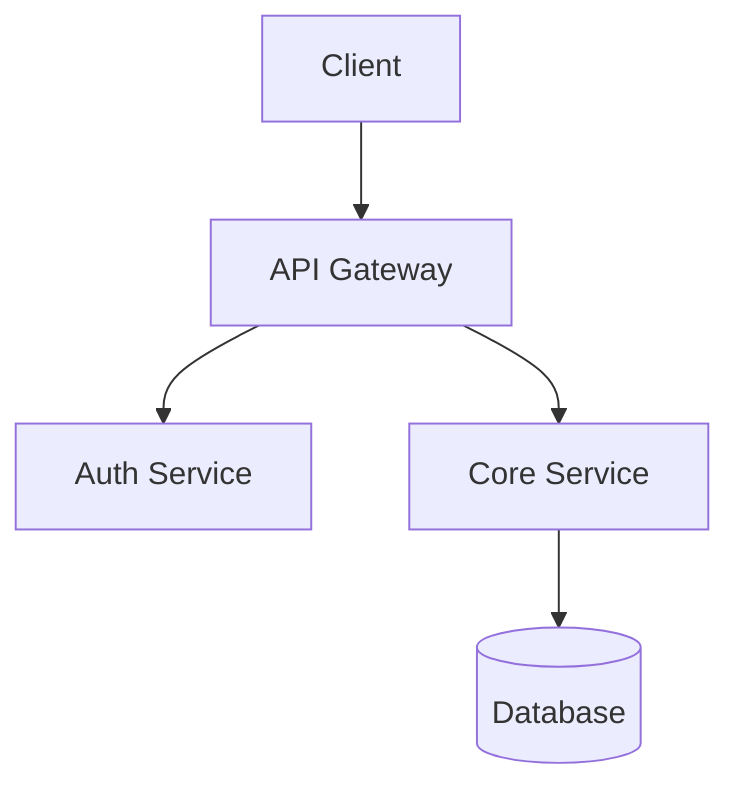

# Master Implementation Plan Template

This template defines the structure for the plan artifact rad-planner aims to generate. The intent is that a fresh AI session with zero prior context could execute it ("zero-context ready"). Whether a given plan actually achieves that depends on how thoroughly the planning session specs each task — there is no automated check for "is this plan executable cold." Use `scripts/plan-lint.py` to catch the mechanical gaps the template can't enforce, and `examples/example-plan.md` to see what a validator-clean output looks like.

## Required Sections

### 1. Project Summary and Overview
```markdown
# Implementation Plan: [Project Name]

**Generated:** [Date]
**Status:** [DRAFT | UNDER REVIEW | APPROVED | IN PROGRESS | COMPLETED]
**Approved by:** [Name or "Pending"]

## 1. Project Summary

**Goal:** [1-2 sentences describing the core objective]

**Scope:** [What this plan covers and what it explicitly does NOT cover]

**Success Criteria:**
- [ ] [Measurable criterion 1]
- [ ] [Measurable criterion 2]
- [ ] [Measurable criterion 3]

**Tech Stack:**
- Frontend: [framework + version]
- Backend: [framework + version]
- Database: [system + version]
- Key Libraries: [list]

**Constraints:**
- [Security requirements]
- [Performance expectations]
- [Dependency version pins]
- [Coding conventions to follow]
```

### 2. Architecture and Visualizations
```markdown
## 2. Architecture

[Mermaid diagram showing component interactions]



**Key Design Decisions:**
| Decision | Choice | Rationale |
|----------|--------|-----------|
| [Decision 1] | [Choice] | [Why] |
| [Decision 2] | [Choice] | [Why] |
```

### 3. Target Files
```markdown
## 3. Target Files

Files to be **created**:
- `src/lib/auth.ts` — Authentication utilities
- `src/api/routes/users.ts` — User API endpoints
- `prisma/schema.prisma` — Database schema

Files to be **modified**:
- `src/app/layout.tsx` — Add auth provider wrapper
- `package.json` — Add dependencies

Files to **NOT touch**:
- `src/config/legacy.ts` — Deprecated, scheduled for removal
```

### 4. Project Blueprint (Milestones)
```markdown
## 4. Milestones

| # | Milestone | Goal | Key Artifacts | Est. Complexity |
|---|-----------|------|---------------|-----------------|
| M1 | Infrastructure Setup | Project scaffold, DB schema, auth foundation | schema.prisma, auth.ts | 3/10 |
| M2 | Core API | CRUD endpoints with validation | routes/*.ts, middleware/*.ts | 5/10 |
| M3 | Frontend Integration | UI components connected to API | components/*.tsx, hooks/*.ts | 6/10 |
| M4 | Testing & Hardening | Full test coverage, edge cases, security | __tests__/*.test.ts | 4/10 |
```

### 5. Refined Implementation Steps
```markdown
## 5. Implementation Steps

### Phase 1: Infrastructure Setup (Milestone M1)

- [ ] **[PENDING]** S1: Initialize project scaffold
  - **Objective:** Create project with TypeScript, configure linting and formatting
  - **Main changes:** package.json, tsconfig.json, .eslintrc
  - **Dependencies:** None
  - **Priority:** High
  - **Complexity:** 2/10
  - **Definition of Done:** `npm run build` succeeds, `npm run lint` passes
  - **Validation:** Run `npm run build && npm run lint`
  - **Rollback:** `git checkout -- .` (no prior state to corrupt)

- [ ] **[PENDING]** S2: Configure database schema
  - **Objective:** Define data models with proper relations and constraints
  - **Main changes:** prisma/schema.prisma, prisma/seed.ts
  - **Dependencies:** [S1]
  - **Priority:** High
  - **Complexity:** 4/10
  - **Definition of Done:** `prisma db push` succeeds, seed data loads
  - **Validation:** Run `npx prisma db push && npx prisma db seed`
  - **Rollback:** `npx prisma db push --force-reset`

### Phase 2: Core API (Milestone M2)
[Continue pattern...]
```

### 6. Checkpoints, Validation, and Rollbacks
```markdown
## 6. Checkpoints

### Checkpoint 1: After Phase 1 (Infrastructure)
- **Gate:** All S1-S3 tasks must be [VERIFIED]
- **Validation:** Run full test suite: `npm test`
- **Rollback:** Reset to initial commit: `git reset --hard HEAD~[n]`
- **Human Review:** Verify schema matches requirements before proceeding
- **Context Action:** Commit all work, update this plan, clear session if needed

### Checkpoint 2: After Phase 2 (Core API)
[Continue pattern...]
```

### 7. Dependencies, Risks, and Considerations
```markdown
## 7. Risks and Considerations

### Technical Risks
| Risk | Likelihood | Impact | Mitigation |
|------|-----------|--------|------------|
| [Risk 1] | Medium | High | [Specific mitigation] |
| [Risk 2] | Low | High | [Specific mitigation] |

### Edge Cases to Handle
- [Edge case 1]: [How to handle]
- [Edge case 2]: [How to handle]

### Anti-Pattern Warnings
- This plan avoids [anti-pattern X] by [specific approach]
- Task S5 explicitly does NOT [anti-pattern Y] because [reason]

### Context Management Notes
- Clear session after Checkpoint 2 (estimated 60% context usage)
- Reference files to load in fresh session: PLAN.md, ARCHITECTURE.md, tasks.md
```

## Template Rules

1. Every task MUST have: ID, Objective, Dependencies, Validation, Rollback (enforced by `scripts/plan-lint.py --mode checklist`)
2. Dependencies use task IDs in arrays: `[S1, S2]` (parsed by the lint script)
3. Complexity scored 1-10 (tasks >7 must be broken into subtasks — enforced by `--mode dag`)
4. Validation must be a runnable command or verifiable condition (vague language detected by `--mode checklist`)
5. Rollback must restore to last known-good state (judgment — risk-assessor checks this)
6. Checkpoints inserted after every milestone (judgment)
7. Anti-pattern warnings reference specific items from the constraints list (judgment)

## What enforces these rules

| Rule | Enforced by |
|---|---|
| Field presence | `scripts/plan-lint.py --mode checklist` |
| DAG validity | `scripts/plan-lint.py --mode dag` |
| Vague language detection | `scripts/plan-lint.py --mode checklist` |
| Complexity ≤ 7 with subtask expansion | `scripts/plan-lint.py --mode dag` |
| Rollback correctness | risk-assessor agent (judgment) |
| Anti-pattern coverage | risk-assessor agent (judgment) |
| Checkpoint placement | risk-assessor agent (judgment) |
| Section order / 7-section structure | Convention only — the model follows the template; nothing rejects a plan missing a section |
